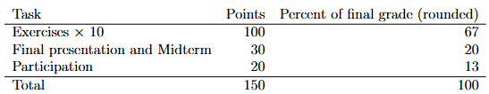
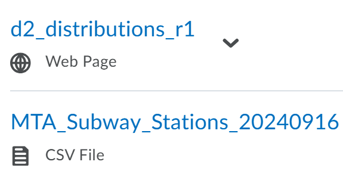

#  Data Analysis and Modeling
## 8-27 Syllabus Day

Every Week: Exercises, demos, mini-lectures
Midterm & Final: Short Analysis & Presentations 
    - Presentations aren't formal

fix later

## File Naming Convention (Important)

(**exercise_number**)_ (**last_name**)(**first_name**)_(**revision number**).R
> Example: 
    - e0_orePeter_r1.R

## Bug Bounty?
The assignments given, will have problems, credit is given if you inform Prof.

## Coffee & Code (Office Hours)
Monday: 1 - 3 in PH233

# 9/15 
## What is data analysis? Rethinking your stats course

Data == givens
- A set of things we agree are true
- Not necessarily strucutred collections of numbers
- Data ≈ "facts"

In this course, data will consist of _labeled numbers_, usually:
1. **Counts**: The number in some class
2. **Measures**: Numerical representation of some phenomena 
3. **Indices**: Combination of multiple measures
4. **Boolean**: To indicate categorical distinctions 

**Nominal variables** are variables w/o order.
**Ordinal Variables** are variables w/ a natural order. 

**Analysis**: "breaking up ofa complex whole ... into its basic elements"
**Data Analysis**: Picking apart data, defining its "basic elements"

**In this class, we will not spend time learning to analyze**:
1. Experimental data
2. Non-tabular quantitiative data (json)
3. Non-numerical data 

**By the end of this class, you should be able to**:
1. Perform basic data manipulations in R
2. Summarize individual columns in the data
3. Summarize relationships between columns, espically through basic regression models
4. Develop statements and conclusions based on these summaries
5. Read and evaluate similar data and reporting

# 9/17
## Analyzing Data Analysis

Three levels of data analysis:
1. ___Indication___: primary statistics (e.g. mean)
2. ___Determination___: Primary statistics with measures of uncertainty (e.g., mean + standard deviation)
3. ___Formal Inference___:  Specific estimates of uncertainty (e.g., p-values, confidence intervals, etc)

## What is a Model
- The definition of a model varies 
- Models are fitted to data to communicate and compare findings
- Stats and data science provides formal models
  
## Models as Tools for Thinking
1. ___Binding___: equires match between phenomena and assumptions
2. ___Reductive___: Systematically ignores ... 
3. ___Working___: ?????

## What About Linear Models
...

## Cultures of Modeling
We can speak of at least two cultures within statistics and data science, and we will add more as we go:

- **Stochastic**: 20th c. statistics
- **Algorithmic**: "machine learning"

# 9/29
Mainly working on **D2_Distributions_r1** in class, didn't finish it tho

# 10/6

