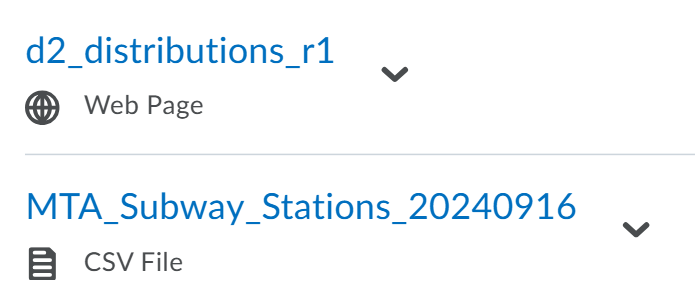

#  Data Analysis and Modeling
## 8-27 Syllabus Day

Every Week: Exercises, demos, mini-lectures
Midterm & Final: Short Analysis & Presentations 
    - Presentations aren't formal
 
fix later

## File Naming Convention (Important)

(**exercise_number**)_ (**last_name**)(**first_name**)_(**revision number**).R
> Example: 
    - e0_orePeter_r1.R

## Bug Bounty?
The assignments given, will have problems, credit is given if you inform Prof.

## Coffee & Code (Office Hours)
Monday: 1 - 3 in PH233
